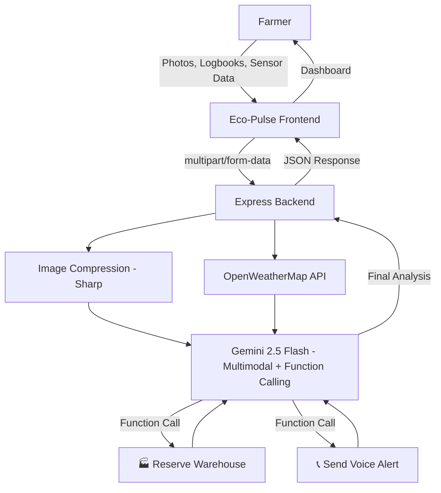

# 🌿 Eco-Pulse — Hyper-Local Climate Resilience

> **Gemini-powered Climate Strategist** that transforms messy farmer inputs into life-saving, structured actions. Built for the Prompt Wars Warmup Challenge.

---

## 🎯 What It Does

**2026 is projected to be one of the hottest years on record.** Eco-Pulse bridges the gap between _Global Weather Data_ and _Local Survival_ for farmers in climate-vulnerable regions.

### The Bridge: Messy Input → Life-Saving Action

| Input (Messy)                            | Transformation                              | Output (Structured)                     |
| ---------------------------------------- | ------------------------------------------- | --------------------------------------- |
| 📸 Field photos & satellite imagery      | Gemini analyzes crop type, ripeness, health | 📊 Crop state assessment                |
| 📝 Handwritten logbook scans             | Gemini extracts yield history & patterns    | 📈 Historical correlation               |
| 🌡️ Raw sensor data (soil moisture, heat) | Correlates with 96-hour weather forecast    | ⚠️ Risk level quantification            |
| —                                        | **Function Call: Warehouse API**            | 🏭 Storage space reserved automatically |
| —                                        | **Function Call: Voice Alert**              | 📞 Local-language voice call to farmer  |

### Example Output

> _"The cyclone will hit your specific plot by Tuesday. Harvest the South-West quadrant NOW to save 70% of your income. Storage space for 500kg of rice has been reserved at District Cooperative #47. Confirmation: WH-12345."_

---

## 🏗️ Architecture



**Tech Stack:**

- **Frontend:** Vanilla HTML/CSS/JS (dark mode, glassmorphism, WCAG 2.1 accessible)
- **Backend:** Node.js + Express
- **AI:** Google Gemini 2.0 Flash (Multimodal + Function Calling)
- **Weather:** OpenWeatherMap API (free tier) — auto-mocks with realistic cyclone data if unavailable
- **Deploy:** Google Cloud Run (Dockerfile included)

---

## 🚀 Quick Start

### Prerequisites

- Node.js ≥ 18
- A Gemini API key ([Google AI Studio](https://aistudio.google.com/))
- _(Optional)_ OpenWeatherMap API key ([Free tier](https://openweathermap.org/api)) — the app includes realistic demo weather data (approaching cyclone scenario) as a fallback, so this is not required for testing

### Local Development

```bash
# 1. Clone
git clone https://github.com/YOUR_USERNAME/Prompt-war-warmup-challenge.git
cd Prompt-war-warmup-challenge

# 2. Install
npm install

# 3. Configure
cp .env.example .env
# Edit .env with your API keys

# 4. Run
npm run dev

# 5. Open http://localhost:8080
```

### Run Tests

```bash
npm test
```

### Deploy to Cloud Run

```bash
# Authenticate
gcloud auth login
gcloud config set project YOUR_PROJECT_ID

# Deploy (auto-builds from Dockerfile)
gcloud run deploy eco-pulse \
  --source . \
  --region us-central1 \
  --allow-unauthenticated \
  --set-env-vars "GEMINI_API_KEY=your_key,OPENWEATHERMAP_API_KEY=your_key"
```

---

## 📁 Project Structure

```
├── server/
│   ├── index.js              # Express entry point
│   ├── config.js             # Env config with validation
│   ├── routes/
│   │   ├── analyze.js        # POST /api/analyze (main endpoint)
│   │   ├── weather.js        # GET /api/weather
│   │   └── health.js         # GET /api/health
│   ├── services/
│   │   ├── gemini.js         # Gemini SDK + Function Calling orchestrator
│   │   ├── weather.js        # OpenWeatherMap service
│   │   └── tools.js          # Tool declarations + execution handlers
│   ├── middleware/
│   │   ├── security.js       # Helmet, CORS, rate limiting
│   │   └── upload.js         # Multer (image uploads)
│   └── utils/
│       ├── imageProcessor.js # Sharp compression for Gemini
│       └── validators.js     # Input sanitization
├── client/
│   ├── index.html            # Semantic HTML5 SPA
│   ├── css/styles.css        # Design system (dark mode)
│   └── js/
│       ├── app.js            # Main controller
│       ├── api.js            # Backend API wrapper
│       ├── ui.js             # DOM rendering
│       └── accessibility.js  # A11y utilities
├── tests/
│   └── unit/                 # Vitest unit tests
├── Dockerfile                # Cloud Run container
└── package.json
```

---

## 🔒 Security

- API keys are **never hardcoded** — loaded from env vars / Cloud Run secrets
- All inputs **sanitized** (XSS prevention, SQL injection protection)
- **Helmet** for HTTP security headers
- **CORS** explicitly configured
- **Rate limiting** (100 req / 15 min)
- **File validation** (MIME type + size limits)

---

## ♿ Accessibility

- **WCAG 2.1 AA** compliant
- Skip-to-content link
- ARIA live regions for dynamic announcements
- Keyboard-navigable (focus rings, focus traps for modals)
- `prefers-reduced-motion` media query support
- Voice alerts serve low-literacy users

---

## 📊 API Reference

### `POST /api/analyze`

Main analysis endpoint. Accepts multipart form data.

| Field         | Type   | Required | Description                       |
| ------------- | ------ | -------- | --------------------------------- |
| `fieldImages` | File[] | No       | Up to 5 images (JPEG, PNG, WebP)  |
| `latitude`    | number | No       | Field latitude (-90 to 90)        |
| `longitude`   | number | No       | Field longitude (-180 to 180)     |
| `cropInfo`    | string | No       | Crop type and details             |
| `sensorData`  | string | No       | Raw sensor readings               |
| `phone`       | string | No       | E.164 phone number                |
| `language`    | string | No       | Alert language (default: English) |

### `GET /api/weather?lat=X&lon=Y`

Returns 5-day weather forecast for given coordinates.

### `GET /api/health`

Health check endpoint for Cloud Run.

---

## 📜 License

MIT — Built for the Google Prompt Wars Warmup Challenge 2026.
