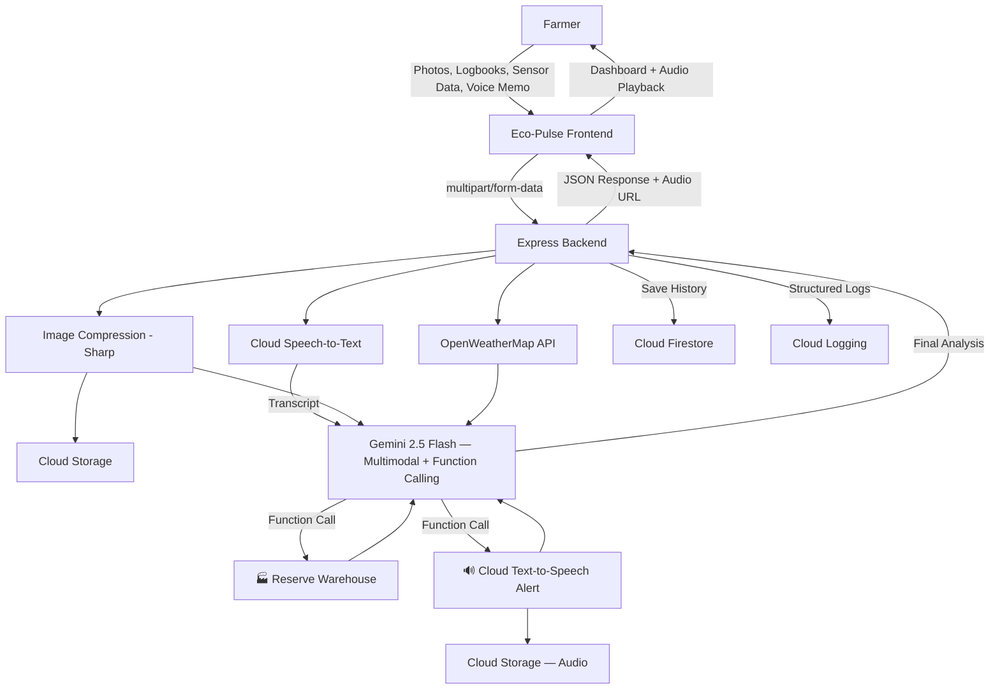

# 🌿 Eco-Pulse — Hyper-Local Climate Resilience


> **Gemini-powered Climate Strategist** that transforms messy farmer inputs — photos, handwritten logbooks, sensor data, **and voice memos** — into life-saving, structured actions. Built for the Prompt Wars Challenge.

---

## 🎯 What It Does

**2026 is projected to be one of the hottest years on record.** Eco-Pulse bridges the gap between _Global Weather Data_ and _Local Survival_ for farmers in climate-vulnerable regions.

### The Bridge: Messy Input → Life-Saving Action

| Input (Messy)                            | Transformation                              | Output (Structured)                     |
| ---------------------------------------- | ------------------------------------------- | --------------------------------------- |
| 📸 Field photos & satellite imagery      | Gemini analyzes crop type, ripeness, health | 📊 Crop state assessment                |
| 📝 Handwritten logbook scans             | Gemini extracts yield history & patterns    | 📈 Historical correlation               |
| 🌡️ Raw sensor data (soil moisture, heat) | Correlates with 96-hour weather forecast    | ⚠️ Risk level quantification            |
| 🎤 **Voice memos** (any language)        | **Cloud Speech-to-Text** transcribes        | 📝 Structured sensor data               |
| —                                        | **Function Call: Warehouse API**            | 🏭 Storage space reserved automatically |
| —                                        | **Function Call: Cloud TTS Voice Alert**    | 🔊 Real audio alert in local language   |

### Example Output

> _"The cyclone will hit your specific plot by Tuesday. Harvest the South-West quadrant NOW to save 70% of your income. Storage space for 500kg of rice has been reserved at District Cooperative #47. Confirmation: WH-12345."_

---

## ☁️ Google Cloud Services Used (7 Services)

This application demonstrates deep, multi-service Google Cloud integration:

| # | Service | Purpose | Why |
|---|---|---|---|
| 1 | **Gemini 2.5 Flash** | Multimodal AI analysis + Function Calling | Core AI engine — analyzes photos, logbooks, sensor data simultaneously |
| 2 | **Cloud Run** | Serverless container deployment | Auto-scales, pay-per-use, zero Cold Start with min instances |
| 3 | **Cloud Text-to-Speech** | Voice alert audio generation | Generates real MP3 alerts in Indian languages (Telugu, Hindi, Tamil, etc.) |
| 4 | **Cloud Speech-to-Text** | Voice memo transcription | Farmers can speak instead of typing — critical for low-literacy users |
| 5 | **Cloud Storage** | Image & audio file storage | Stores field photos and generated alert audio with signed URLs |
| 6 | **Cloud Firestore** | Analysis history persistence | Farmers can review past analyses and track recommendations over time |
| 7 | **Cloud Logging** | Structured production logging | JSON-structured logs with severity levels and request correlation IDs |

---

## 🏗️ Architecture



**Tech Stack:**

- **Frontend:** Vanilla HTML/CSS/JS (dark mode, glassmorphism, WCAG 2.1 AA accessible)
- **Backend:** Node.js + Express
- **AI:** Google Gemini 2.5 Flash (Multimodal + Function Calling)
- **Voice Input:** Google Cloud Speech-to-Text (8 Indian languages)
- **Voice Output:** Google Cloud Text-to-Speech (real MP3 audio alerts)
- **Storage:** Google Cloud Storage (images + audio with signed URLs)
- **Database:** Google Cloud Firestore (analysis history)
- **Logging:** Google Cloud Logging (structured JSON logs)
- **Weather:** OpenWeatherMap API (free tier) — auto-mocks with cyclone data if unavailable
- **Deploy:** Google Cloud Run (Dockerfile included)

---

## 🚀 Quick Start

### Prerequisites

- Node.js ≥ 22
- A Gemini API key ([Google AI Studio](https://aistudio.google.com/))
- _(Optional)_ GCP Project with enabled APIs: Cloud TTS, STT, Storage, Firestore, Logging
- _(Optional)_ OpenWeatherMap API key — app includes realistic demo weather fallback

### Local Development

```bash
# 1. Clone
git clone https://github.com/BharatNischal/Prompt-war-warmup-challenge.git
cd Prompt-war-warmup-challenge

# 2. Install
npm install

# 3. Configure
cp .env.example .env
# Edit .env with your API keys

# 4. Run
npm run dev

# 5. Open http://localhost:8080
```

### Run Tests

```bash
npm test                  # Run all tests
npm run test:coverage     # With coverage report
npm run lint              # Lint check
```

### Deploy to Cloud Run

```bash
# Authenticate
gcloud auth login
gcloud config set project YOUR_PROJECT_ID

# Deploy (auto-builds from Dockerfile)
gcloud run deploy eco-pulse \
  --source . \
  --region us-central1 \
  --allow-unauthenticated \
  --set-env-vars "GEMINI_API_KEY=your_key,GCP_PROJECT_ID=your_project,GCS_BUCKET=your_bucket"
```

---

## 📁 Project Structure

```
├── server/
│   ├── index.js              # Express entry point + request ID middleware
│   ├── config.js             # Env config with GCP settings
│   ├── routes/
│   │   ├── analyze.js        # POST /api/analyze (main pipeline)
│   │   ├── weather.js        # GET /api/weather
│   │   ├── history.js        # GET /api/history (Firestore)
│   │   └── health.js         # GET /api/health
│   ├── services/
│   │   ├── gemini.js         # Gemini SDK + Function Calling orchestrator
│   │   ├── weather.js        # OpenWeatherMap with demo fallback
│   │   ├── tools.js          # Tool declarations + execution handlers
│   │   ├── tts.js            # Google Cloud Text-to-Speech
│   │   ├── speech.js         # Google Cloud Speech-to-Text
│   │   ├── storage.js        # Google Cloud Storage
│   │   ├── firestore.js      # Google Cloud Firestore
│   │   └── logger.js         # Google Cloud Logging
│   ├── middleware/
│   │   ├── security.js       # Helmet, CORS, rate limiting
│   │   └── upload.js         # Multer (images + audio uploads)
│   └── utils/
│       ├── imageProcessor.js # Sharp compression for Gemini
│       ├── validators.js     # Input sanitization
│       └── errors.js         # Custom error classes
├── client/
│   ├── index.html            # Semantic HTML5 SPA
│   ├── css/styles.css        # Design system (dark mode)
│   └── js/
│       ├── app.js            # Main controller
│       ├── api.js            # Backend API wrapper
│       ├── ui.js             # DOM rendering
│       └── accessibility.js  # A11y utilities
├── tests/
│   ├── unit/                 # Unit tests (validators, tools, weather, errors, GCP)
│   └── integration/          # API endpoint tests
├── .github/workflows/test.yml # CI/CD pipeline
├── Dockerfile                # Cloud Run container
├── vitest.config.js          # Test config with coverage
├── eslint.config.js          # Lint config
└── package.json
```

---

## 🔒 Security

- API keys **never hardcoded** — loaded from env vars / Cloud Run secrets
- All inputs **sanitized** (XSS prevention, SQL injection protection)
- **Helmet** for HTTP security headers
- **CORS** explicitly configured
- **Rate limiting** (100 req / 15 min)
- **File validation** (MIME type + size limits for images and audio)
- Request **correlation IDs** for audit trails

---

## ♿ Accessibility

- **WCAG 2.1 AA** compliant
- Skip-to-content link
- ARIA live regions for dynamic announcements
- Keyboard-navigable (focus rings, focus traps for modals)
- `prefers-reduced-motion` media query support
- **Voice input** for farmers who cannot type (Cloud Speech-to-Text)
- **Voice output** for low-literacy users (Cloud Text-to-Speech)
- `aria-busy` during loading states

---

## 📊 API Reference

### `POST /api/analyze`

Main analysis endpoint. Accepts multipart form data.

| Field         | Type   | Required | Description                       |
| ------------- | ------ | -------- | --------------------------------- |
| `fieldImages` | File[] | No       | Up to 5 images (JPEG, PNG, WebP)  |
| `voiceNote`   | File   | No       | Audio recording (WebM, OGG, WAV)  |
| `latitude`    | number | No       | Field latitude (-90 to 90)        |
| `longitude`   | number | No       | Field longitude (-180 to 180)     |
| `cropInfo`    | string | No       | Crop type and details             |
| `sensorData`  | string | No       | Raw sensor readings               |
| `phone`       | string | No       | E.164 phone number                |
| `language`    | string | No       | Alert language (default: English) |

### `GET /api/history`

Returns past analyses from Cloud Firestore. Query params: `limit` (default 10).

### `GET /api/weather?lat=X&lon=Y`

Returns 5-day weather forecast for given coordinates.

### `GET /api/health`

Health check endpoint for Cloud Run.

---

## 📜 License

MIT — Built for the Google Prompt Wars Challenge 2026.
